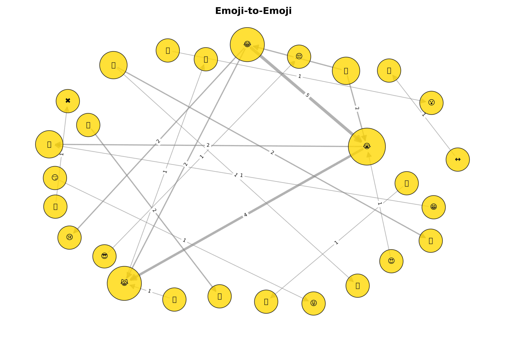
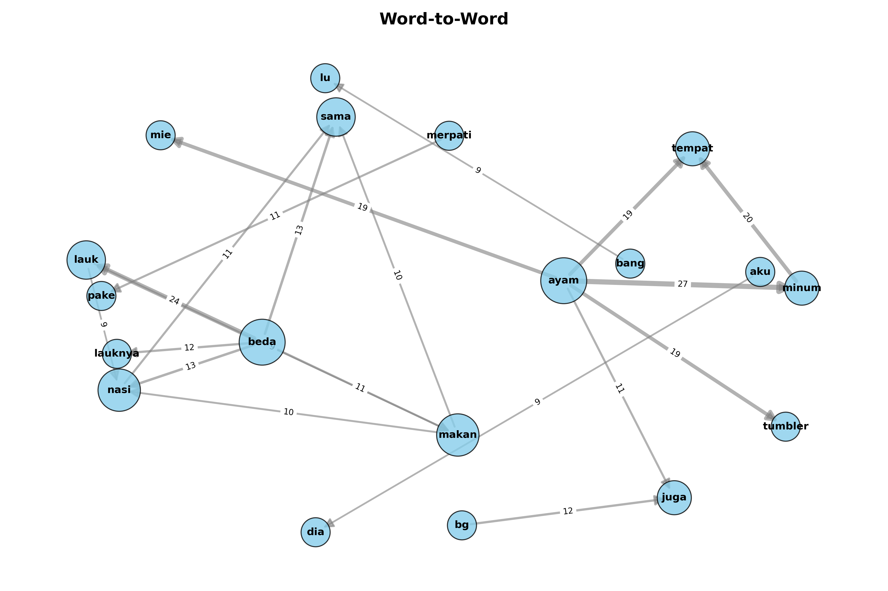
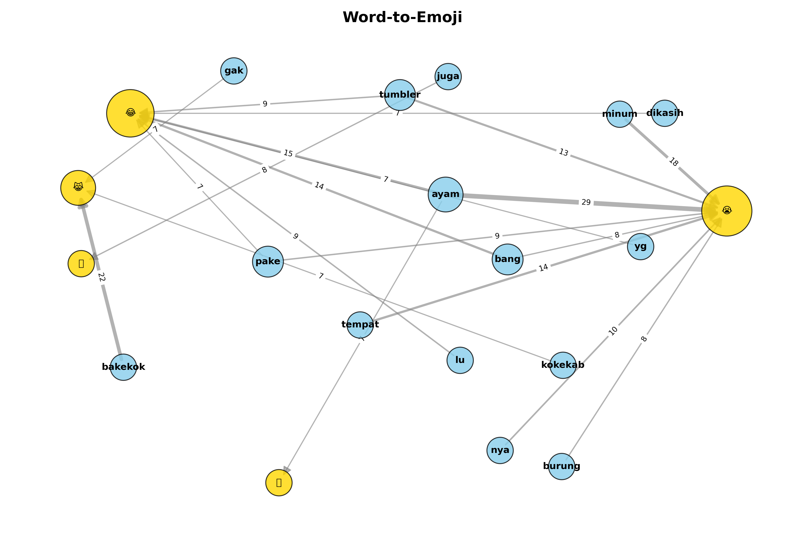
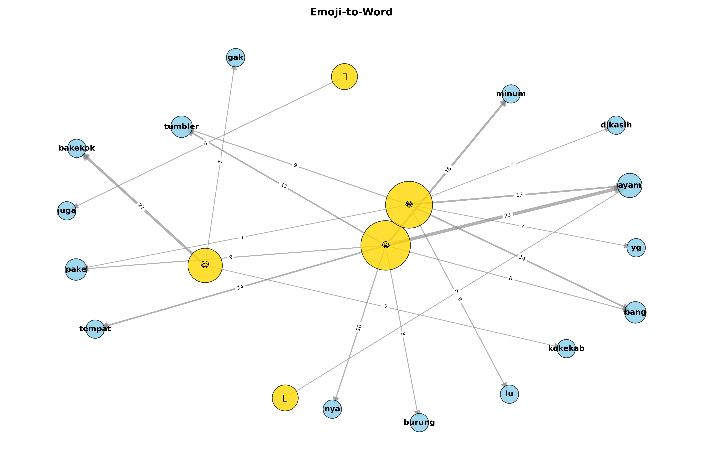

# Random Project - Comment and Emoji in Instagram Meme Content

Analyze the information of word and emoji in Instagram meme content.

## Context

The analyzed meme is an Instagram reel about **relationships**, where the man feels "inferior" compared to the woman.  
The video caption says: *"kenapa takut, kan sama-sama makan nasi"* (“why be afraid, we both eat rice”).  

In the meme, the man is symbolized with **simpler, cheaper things** (e.g., Kapal Api instant coffee, using pigeons to communicate), while the woman is symbolized with **luxury or modern things** (e.g., Starbucks, using an iPhone).  

Original content can be found here: https://www.instagram.com/p/DNMhspDTajA/

This project explores the **comment section** under the meme, which is full of analogies, slang words, and emojis. By analyzing the network of words and emojis, we can see how netizens creatively respond to the theme of “social gap in relationships” with humor and sarcasm.

## Prerequisites

- Python 3.10 or higher
- For scraping the comment data, check this repo https://github.com/billycemerson/IG-Scraping

## Usage

1. **Navigate to the source folder**:
   ```bash
   cd src
   ```

2. **Run the scraper**:
   ```bash
   python scrape_comment.py
   ```

3. **Run the word analysis**:
   ```bash
   python word.py
   ```

4. **Run the emoji analysis**:
   ```bash
   python emo.py
   ```

## Result Example

### Emoji to Emoji Network


### Word to Word Network


### Word to Emoji Network


### Emoji to Word Network


## Quick Findings

- The most frequent emoji pairs are **😂 + 😭**, showing how users mix laughter with “crying in pain” humor.  
- Many comments **extend the analogy** in the meme, contrasting *cheap/simple vs. expensive/luxury* things.  
  - Example:  
    - *“dia: bahasa inggris 😎 | aku: bahasa kalbu 😔”*  
    - *“dia: americano | aku: kopi item”*  
    - *“dia: pakai WhatsApp | aku: pakai merpati 😞”*  
    - *“dia: di kafe | aku: di angkringan 😂”*  
- The comment section turns into a **collective creativity playground**, where each user builds on the previous analogy, making the humor snowball even further.